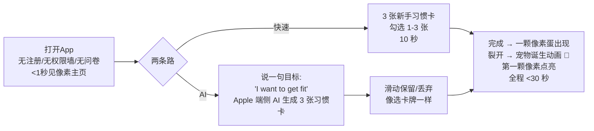
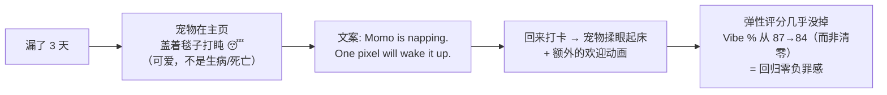

# TR-20260917-像素习惯Habibling复刻升级-操作指南

> **本文档目标**：任何 LLM / 开发者拿到本文档后，可以从零复刻出一款在功能、UI、体验、价格上全面超越 Habit Pixel（像素习惯）的 iOS 原生习惯养成 App。
> **竞品**：Habit Pixel（毛里求斯 solo 开发者 Hirvesh Munogee，RevenueCat 核验 MRR $3,142 / 2026-09-07，跨平台 Flutter 系 150MB）
> **我们的产品代号**：**Habibling**（Habit + -ling，"你的像素小宠，一天一颗像素陪你长大"）
> **文档日期**：2026-09-17
> **目标市场**：美国（纯英文产品）
> **复刻+升级公式**：复刻 Habit Pixel 的像素热力图 + 像素宠物激励 → 叠加 Kadō MIT 基座（弹性评分/可改历史/免费云同步）+ Finch 式无惩罚宠物情感引擎 + Apple 端侧 AI + GLM BYO 深度报告 + Watch/灵动岛/透明定价，六维碾压。

---

# ⭐ 第一部分：APP 命名与副标题（最优先）

## 1.1 最终命名方案

| 项目 | 内容 | 说明 |
|---|---|---|
| **APP 名称** | **Habibling** | 主品牌名，3 音节 ha-BIT-ling，朗朗上口 |
| **App Store 完整标题**（30字符内） | `Habibling: Pixel Pet Habits` | 27 字符；内嵌 habit / pixel pet 双高热词 |
| **副标题**（30字符内） | `Grow a pet, one habit a day` | 28 字符；一句话讲清核心玩法+情感钩子 |
| **Slogan** | `One pixel a day.` | 打卡哲学+可传播口号 |
| **域名建议** | habibling.app / gethabibling.com | 上线前查询购买 |
| **社交账号** | @habibling（TikTok/IG/X） | 品牌统一 |

## 1.2 命名深度分析（为什么是 Habibling）

### 候选名淘汰过程（已逐一经网络实时核查，2026-09-17）

| 候选名 | 核查结果 | 结论 |
|---|---|---|
| Habit Pixel / HabitKit / Streaks / Finch / Habitica | ❌ 竞品本身或知名在售 App | 严禁使用 |
| **Pip** | ❌ 是 Habit Pixel 官方宠物 IP 名（其 v27.4 版本的"Pip 伙伴"），且 App Store 有同名应用 | 淘汰 |
| Pixeling | ❌ PewDiePie 手游《Pixelings》知名 IP；另有 Year in Pixels 类目扎堆 | 淘汰 |
| Bitling / Bitlings | ❌ 《Bitlings》电子宠物策略游戏（Southside Games，2026-05 上架 App Store） | 淘汰 |
| Pixlit | ❌ PiXLit 教育 App（Mr W's Lab）+ itch.io 同名像素游戏 + Chrome 扩展 | 淘汰 |
| Tessella | ⛔ 本团队 HabitKit 指南已用作品牌（见归档文档），严禁跨产品复用 | 淘汰 |
| **Habibling** | ✅ 全网检索**无任何 App/游戏/商标冲突记录**（2026-09-17 实时核查零命中） | **✅ 选用** |
| 备用1：Pixelot | ✅ 检索无 iOS 冲突（pixel+owlet 小猫头鹰意象） | 备选 |
| 备用2：Streakling | ✅ 检索无 iOS 冲突（streak 关键词加成） | 备选 |

### 五维度评分（满分 5）

| 维度 | 得分 | 分析 |
|---|---|---|
| **ASO 搜索优化** | 5 | 名字本身**包含完整关键词 "habit"**——App Store 名称前缀匹配是权重最高的排名信号之一；用户搜 "habit tracker / habit pet" 天然命中；完整标题再补 pixel pet 双词 |
| **品牌记忆度（最关键）** | 5 | -ling 后缀（duckling/seedling）在英语母语者心中=「可爱的小生物」，一听就懂「习惯小宠物」；发音 ha-BIT-ling 自带产品解释，零教育成本 |
| **功能描述性** | 5 | 名字=品类（habit）+ 形态（-ling 小宠物），配合副标题立即传达 "grow a pet by keeping habits" |
| **情感共鸣** | 5 | 「它是我养成的小家伙」——宠物依恋感是 Finch 4.9★/73.7万评分的情感引擎；Habibling 把这种依恋直接写进名字 |
| **国际化适配** | 4.5 | 纯拉丁词根构造，英/德/法/西/日语均无负面谐音；唯一注意：日语市场建议本地化为「ハビブリング」 |

### 病毒传播机制设计（命名配套）

1. **宠物进化即内容**：Habibling 蛋→幼体→成体的进化瞬间是天然 TikTok 素材（"Day 1 vs Day 30 我的 Habibling 长大了"），进化动画自带分享按钮。
2. **口号**：`One pixel a day.`（一天一颗像素）——既是方法论（微习惯），又是可印在周边/水印上的价值观标签。
3. **TikTok 话题**：#OnePixelADay #MyHabibling 挑战：晒 30 天宠物进化 + 年度马赛克。
4. **年度马赛克水印**：App 内导出年度像素画自动带 `habibling.app` 水印 → 用户自发分享 → 病毒回流。

## 1.3 App Store 元数据全套（可直接使用）

```
App Name (30): Habibling: Pixel Pet Habits
Subtitle (30): Grow a pet, one habit a day
Keywords (100): habit tracker,daily streak,pet,motivation,pixel,heatmap,routine,goals,self care,productivity
Promo Text (170): Your habits hatch a tiny pixel pet. Miss a day? It naps — never dies. Free iCloud sync, no account, no guilt. One pixel a day.
Description 开头三行（决定转化率）:
  • Your pet grows from your real habit data — it never dies, never guilt-trips
  • Edit any past day. Your history is never wrong.
  • Free iCloud sync on iPhone, iPad, Watch. No account. No ads.
```

---

# 一、竞品深度分析

## 1.1 Habit Pixel 基本盘（2026-09-07 RevenueCat 核验数据）

| 维度 | 数据 |
|---|---|
| 收入 | **MRR $3,142**（ARR $37,708），2,776 活跃订阅，ARPPU $1.13，LTV $11，28 天 MRR 增速 +7.9% |
| 评分 | App Store 4.9★（150+ 评论），全平台合计 883 评分 / 均 4.5★；Google Play 50K+ 下载 |
| 技术栈 | 跨平台框架（Flutter 系），**包体 150MB**；本地离线存储，**无账号无云同步** |
| 定价 | 免费 + Pro：**$1.99/月、$11.99/年、$29.99 买断**；PPP 购买力平价定价（各国不同价） |
| 平台 | iOS / iPadOS / macOS / visionOS / Android（2026-09 时点） |
| 核心玩法 | 每次打卡点亮一个像素 → 日历热力图（GitHub 风格）+ 连击目标；**Pip 像素伙伴**（2026-09 新增：会探索主页的动画宠物） |
| 功能清单 | 打卡、每日/每周/每月目标、每日指标、多次打卡、智能提醒+快捷操作、笔记+心情日记、分类、归档、补签（最长 5 年）、主题、网格/紧凑视图、周起始日、语音记录（**设备端转写**）、跳过某天、Pro 专属：无限习惯/多款式主屏+锁屏小组件/习惯+分类分析/JSON+CSV 导入导出 |
| 增长三板斧 | ① PPP 定价 ② 12 语言本地化 ③ 季节节奏（黑五买断 7 折=首个 $2K 月；1 月 1 日 Uneed 日榜第 2 → 200 单/$1K MRR） |

**创始人自曝的教训（Indie Hackers 2026-01）**：
> "Fix onboarding before chasing growth" ——上线初期 **onboarding 摩擦让 MRR 卡在 $28** 长达数月；修好转化链路后钱才开始动。

## 1.2 市场警报：App Store 已出现同名山寨

`Habit Pixel: Streak Tracker`（LEAN ASIA CO., LTD，id6759969192）已上架，主打 mood tracking + heatmap + one-tap check-in——**证明两点：① 像素+习惯的需求真实且正在被瓜分；② 品牌名冲突风险真实存在**。我们必须用零冲突的新品牌（Habibling）+ 它抄不走的深度（云同步/Watch/AI/宠物进化）建立护城河。

## 1.3 类目共性痛点（1-3 星差评语料交叉分析，2026 上半年）

| # | 痛点 | 证据 | 影响的竞品 |
|---|---|---|---|
| 1 | **断签焦虑 > 习惯失败本身**："我丢的不是一天，是 87 天 streak" → 用户为保 streak 作弊打卡，或丢档后彻底弃用 | Unstar 2026-05 对 Streaks/Habitica/Way of Life/Strides 的差评分析：所有 4 款 App 共性第一痛点 | 全类目（含 Habit Pixel 的 raw streak） |
| 2 | **静默同步失败丢数据**：月度 streak 数据无声丢失是 1 星重灾区 | Unstar 分析第 2 大共性 | Habitica 等；Habit Pixel 干脆无同步（5 平台各自孤岛） |
| 3 | **游戏化疲劳**：Finch 宠物三个月后"变成又一件家务"；Habitica 太复杂+iOS 版落后+HP 惩罚机制制造焦虑（"I was bullied out of a party"） | habi.app 2026-02 横评 / habitbox 2026-07 Finch 评测 | Finch、Habitica |
| 4 | **免费额度突袭+分析付费墙**：先让你投入数据再弹墙；真正有用的统计被锁 | recurrr/unstar 汇总 | Streaks（无免费档）、Way of Life、Habit Pixel（widget 付费墙+免费习惯数限制） |
| 5 | **改不了历史**（习惯类第一大功能性差评） | HabitKit 最高赞差评 119👍（本团队 2026-09-16 指南已验证） | HabitKit；Habit Pixel 有补签（平手，必须保持） |
| 6 | **无 AI、无 Watch、无 Live Activities** | Habit Pixel 商店页功能清单全查无 | Habit Pixel 全线 |

**空位结论**：没有任何一款 App 同时做到——**像素艺术激励 + 会成长的宠物（但永不惩罚）+ 可改历史 + 免费云同步 + Watch/灵动岛 + AI 教练 + 透明定价**。这就是 Habibling 的空位。

---

# 二、痛点研究结论（pain-point-hunter 方法论输出）

## 2.1 目标用户画像（美国市场）

| 人群 | 占比预估 | 核心动机 | 付费意愿 |
|---|---|---|---|
| 自律新手/新年决心人群（25-40） | 45% | "想要一个不惩罚我的工具" | 中高（1月峰值，$20-30 一次性可接受） |
| Finch/虚拟宠物迁移用户（18-34，女性偏多） | 30% | 宠物长大了不想弃养，但嫌 Finch 功能浅/订阅贵 | 高（已付费 $29.99/yr 习惯的迁移成本极低） |
| ADHD/执行功能障碍人群 | 15% | 极简低摩擦+视觉化+外部激励物 | 中（对"弹性评分"敏感度高） |
| 游戏化爱好者（Habitica 出走者） | 10% | 想要像素/RPG 元素但不要复杂性 | 中 |

## 2.2 痛点评级：🥇 金级 (84/100)

> 铜级→金级的跃升逻辑：Habit Pixel 原始评级 58（$1K MRR 太小），但 2026-09 已增至 **$3.1K MRR / 2,776 付费订阅且同比增速 +7.9%/月**，且出现山寨跟进——市场验证已完成，从"观察"升级为"详细规划"。

## 2.3 用户原话（多渠道采集）

> "Most habit trackers felt like dull checklists."（大多数习惯 App 无聊得像清单）—— 创始人 Hirvesh 立项动机（Indie Hackers）
>
> "I lost my 87-day streak."（我丢了 87 天的连续记录）—— 类目 1-3 星差评最高频句式（Unstar 2026-05）
>
> "The gamification can become a chore… the same pet mechanic that delights you in week one can start to feel like one more thing to tend in month three."（游戏化变成家务——第一周讨喜的宠物机制，第三个月变成又一件要伺候的事）—— Finch 长期用户（habitbox 评测 2026-07）
>
> "HP loss mechanic creates anxiety instead of motivation."（掉血机制制造的是焦虑不是动力）—— Habitica 用户（habi.app 横评 2026-02）

## 2.4 痛点→功能映射表（本产品每个升级点都有出处）

| 痛点 | Habibling 的解法 | 对应章节 |
|---|---|---|
| 断签焦虑 | EMA 弹性评分 "Vibe %"：漏一天不清零；宠物对漏卡的唯一反应是「盖着像素毯子打盹」 | §6.2 / §5 |
| 静默丢数据 | CloudKit 免费同步+同步状态如实显示+全量导出 | §6.1 / §5.2 |
| 游戏化疲劳 | 宠物**零维护**：它只反映你的数据，永远不需要"喂"——你打卡它就长大，仅此而已 | §三 |
| 免费突袭 | 免费档无限习惯+小组件全免费+边界写在商店页（根除付费墙突袭） | §七 |
| 改不了历史 | 昨日救援卡+任意历史日编辑（Kadō 已上架验证） | §6.3 |
| 无 AI/Watch/灵动岛 | 端侧 Apple FM + GLM BYO 双引擎；Watch App；Live Activity 像素宠物 | §6.6 / §六 |
| 包体 150MB | 纯原生 ~15MB（10 倍差价，商店页明示攻击点） | §八 |

---

# 三、GitHub 二次开发项目研究（核心技术来源）

## 3.1 选定项目矩阵（2026-09-17 GitHub MCP 实时审计）

| 项目 | License | 技术栈 | 对我们的价值 | 使用方式 |
|---|---|---|---|---|
| **scastiel/kado** ⭐核心基座 | MIT（仓库 LICENSE 已核验） | SwiftUI + @Observable + SwiftData + CloudKit + WidgetKit + App Intents + StoreKit 2，零第三方依赖 | 已上架 App Store 的完整骨架：**可编辑历史日历、EMA 弹性评分（docs/habit-score.md 算法规范）、CloudKit 同步状态机、widget、CSV/JSON 导入导出**；2026-09-12 仍在活跃提交 | Fork 后作为代码基座二次开发 |
| **amangeldybaiserkeev/TeymiaHabit** ⭐ | MIT（LICENSE 原文已核验） | SwiftUI + SwiftData + CloudKit + ActivityKit + RevenueCat，16 语言 | **Live Activities/灵动岛、小组件、内购门控、本地化工程模式**的实现参考 | 抽取模块级代码 |
| banghuazhao/habit-diary | ❌ **CC BY-NC 4.0（禁止商用）** | SwiftUI + GRDB，游戏化（35+ 模板、F-SSS 12 级评分、成就系统） | **仅作设计思想参考**（成就/等级体系的 UX 编排），严禁复制任何代码 | 只读学习 |
| FriesI23/mhabit | Apache-2.0 | Flutter | Loop 系智能评分参考 | 仅算法参考 |
| iSoron/uhabits (Loop) | GPLv3 | Kotlin/Android | EMA 评分原始出处（**GPL 不可抄代码**，Kadō 已用 Swift 重写规避） | 只读理解算法 |
| hghachvr/grow-plants | 待查（新仓库） | 像素放置游戏 | 像素农田成长的动效节奏参考 | 灵感参考 |

> ⚠️ **法务红线**：habit-diary 为 CC BY-NC 4.0（NonCommercial），商业 App 一行代码都不能碰；Loop 为 GPLv3 同理。只用 Kadō + TeymiaHabit 两个 MIT 仓库；在 App 的 About 页与 ACKNOWLEDGEMENTS 中致谢 Kadō（MIT 要求保留版权声明）。

## 3.2 Kadō 项目结构与我们的改造点

```
kado/                       # 主 App（改名为 Habibling）
Packages/KadoCore/          # 共享 Swift Package：@Model、领域类型、计算器、Intent
KadoWidgets/                # Widget 扩展（读 App Group JSON 快照，不碰 SwiftData）
KadoTests/                  # 单元测试（Swift Testing）
docs/habit-score.md         # EMA 评分算法规范 ⭐ 直接复用
docs/streak.md              # 连击算法规范
CLAUDE.md                   # 架构约定（SwiftData/CloudKit 形状规则、并发）
Tips.storekit               # StoreKit 2 配置底子
```

**我们的二开改造清单（在 Kadō 基础上）**：

1. **新增像素宠物层（核心差异化）**：`PixelPet` 纯函数状态机 + 16×16 精灵图渲染（Canvas nearest-neighbor）+ 进化动画。
2. **新增像素马赛克主视图**：Habit Pixel 式日历热力图（Kadō 是矩阵浅色块，升级为满彩像素块 + 宠物互动）。
3. **新增 AI 层**：Apple Foundation Models（端侧免费）+ GLM-5.3-Flash（BYO Key 云端可选）。
4. **新增 Watch App + Live Activities**（借 TeymiaHabit 模式）。
5. **新增通知可靠性引擎**：4 周滚动预排 + Done/Snooze 锁屏操作（Kadō 有基础提醒，我们强化）。
6. **商业化**：Tip Jar → StoreKit 2 非消耗型买断 + 可选云订阅（Kadō 已有 StoreKit 底子）。

---

# 四、实现流程图（工程实现顺序）

```mermaid
flowchart TD
    A[阶段0: 准备<br/>Apple 开发者账号 / App Store Connect 查重 Habibling<br/>购买精灵图素材 16x16 表] --> B[阶段1: 基座搭建<br/>Fork scastiel/kado → 改名 Habibling<br/>SwiftUI + SwiftData + CloudKit 跑通]
    B --> C[阶段2: 数据层扩展<br/>Habit/Completion @Model 扩展<br/>type/counter/negative/mood 字段<br/>VersionedSchema + CloudKit private DB]
    C --> D[阶段3: 核心算法<br/>EMA 弹性评分器 α=0.05<br/>Vibe % / 连击 / 完成率<br/>Swift Testing 全覆盖]
    D --> E[阶段4: 像素宠物引擎 ⭐<br/>PetState = f(EMA历史, 季节, 创建日) 纯函数<br/>蛋→幼体→成体 16x16 精灵渲染<br/>打卡=喂浆果 300ms 动画+触觉]
    E --> F[阶段5: 主界面<br/>像素马赛克热力图 + 今日视图<br/>昨日救援卡 + 心情一日一像素]
    F --> G[阶段6: 通知引擎<br/>4 周滚动预排 + 锁屏 Done/Snooze<br/>智能提醒文案（端侧 AI 变体）]
    G --> H[阶段7: 扩展面<br/>WidgetKit 宠物小组件（免费）+ 锁屏组件<br/>Watch App + Live Activity 灵动岛<br/>App Intents + Siri 一键打卡]
    H --> I[阶段8: AI 层<br/>Apple FM 端侧: 宠物对话/计划/周报<br/>GLM-5.3-Flash BYO: 月度深报+拍照记习惯]
    I --> J[阶段9: 商业化<br/>StoreKit 2 买断 Plus $24.99<br/>Cloud+ BYO/托管 $1.99月<br/>透明价格表]
    J --> K[阶段10: 分享与增长<br/>年度马赛克 4K 导出水印<br/>宠物进化时刻分享卡<br/>6语言本地化 / ASO / TikTok 模板]
    K --> L[阶段11: TestFlight → App Store 提审<br/>卡位 12月中旬=新年流量]
```

**里程碑周期**：阶段 1-4 约 2 周（宠物引擎是唯一新造轮子）；5-7 约 1.5 周；8-10 约 1 周；合计 **4-5 周可提审**（基座是已上架验证过的 MIT 代码，风险大降）。

---

# 五、用户使用流程图（极端重要：30 秒上手、爽感循环）

## 5.1 首次启动（30 秒完成，零学习成本）



> **设计要点**：Habit Pixel 创始人自曝 onboarding 摩擦曾把 MRR 卡死在 $28——我们的 onboarding 必须**一次屏幕一个动作**：选卡→命名→见宠物，三步走完，中途零弹窗零付费墙零权限请求（通知权限在第一次打卡成功后才请求，时机=用户最有好感的一刻）。

## 5.2 每日核心循环（爽感引擎）

```mermaid
flowchart TD
    A[早上: 通知到达<br/>锁屏直接点 Done ✓<br/>0 次打开App也能打卡] --> B[打开App: 宠物迎面跑来<br/>按时段问候（端侧生成）<br/>今日瓷砖待点亮]
    B --> C[点一下 = 打卡<br/>像素点亮 + 浆果爆裂动画<br/>+ 触觉震动 | 全程 <3 秒]
    C --> D{连续多天后}
    D -->|看宠物| E[宠物进化! 蛋→幼体→成体<br/>自动播放进化动画<br/>→ 一键分享进化时刻=病毒点]
    D -->|看数据| F[Vibe % 87 分<br/>漏一天不清零<br/>无断签焦虑=爽]
    C --> G{忘了昨天?}
    G -->|是| H[首页救援卡:<br/>补录昨天? 一键 ✓<br/>历史永远改得动=爽]
    F --> I[周一早: Pixel Post 信件<br/>宠物送来 3 条洞察+1 条小建议<br/>端侧 AI 零等待]
    H --> I
    I --> J[月末: 导出年度像素马赛克<br/>水印 habibling.app<br/>朋友看到→下载=病毒循环]
    J --> A
```

## 5.3 漏卡场景的心理安全设计（对 Finch 疲劳与 Habitica 焦虑的双杀）



> **红线**：宠物**永不**死亡/生病/离家出走/掉血；永远不存在"你不打卡它就惨"的道德绑架（这是 Tamagotchi 式产品的死亡陷阱，也是 Finch 后期疲劳的根源——我们把宠物从「需要照看的孩子」重新定义为「反映你的镜子」）。

## 5.4 全功能触达规则：任何功能 ≤ 2 次点击

| 需求 | 路径 | 点击数 |
|---|---|---|
| 打卡今天 | 主页点瓷砖 | 1 |
| 补昨天 | 首页救援卡 | 1 |
| 补任何历史日 | 习惯→日历点那天 | 2 |
| 从锁屏打卡 | 通知长按→Done | 1 |
| 桌面打卡 | 宠物小组件 | 1 |
| 问 Siri | "Mark read in Habibling" | 0 |
| 看 AI 周报 | 首页 Pixel Post 卡片 | 0（自动出现） |
| 记心情 | 主页底部心情一行 | 1 |
| 分享马赛克 | Stats→分享 | 2 |

---

# 六、软件数据流图（极端重要：合理、防错、可信赖）

## 6.1 总体数据流

```mermaid
flowchart TB
    subgraph 输入层["数据输入（5 条通道，全部防错）"]
        IN1[App 内点击打卡]
        IN2[小组件/锁屏通知 Done<br/>App Intent 写入]
        IN3[Siri/快捷指令]
        IN4[历史补录: 日历/救援卡<br/>value+date 显式指定]
        IN5[拍照记习惯: GLM 视觉识别<br/>仅用户显式触发, 结果可改]
    end

    subgraph 本地层["iPhone 本地（SwiftData, Source of Truth）"]
        DB[("SwiftData Store<br/>Habit / Completion / MoodEntry<br/>唯一索引: habitId+dayBucket")]
        CALC[EMA评分器 + 连击计算<br/>写入 DailyScore 缓存]
        PET[PetState 纯函数推导<br/>f(评分历史,季节,创建日)<br/>⚠️ 不落库=永不损坏]
        SNAP[App Group JSON 快照<br/>供 Widget/Watch 进程读取]
    end

    subgraph 同步层["iCloud（用户私有 CloudKit DB，零服务器成本）"]
        CK[CloudKit private database<br/>SwiftData cloudKitDatabase:.private<br/>记录级 last-writer-wins + 幂等]
    end

    subgraph AI层["AI 双引擎"]
        AFM[Apple Foundation Models 端侧<br/>iOS 18.2+/26 免费<br/>宠物台词/计划/周报/心情洞察]
        GLM[GLM-5.3-Flash BYO Key<br/>api.z.ai 美元计价 推理+视觉<br/>月度深度报告/拍照记习惯]
    end

    subgraph 输出层["呈现层"]
        UI[像素主页/马赛克/统计]
        PETUI[宠物渲染+进化动画]
        W[小组件/锁屏/灵动岛/Watch]
        N[通知引擎 4 周滚动预排]
        EXP[JSON/CSV 无损导出]
        SHARE[马赛克 4K 分享图]
    end

    IN1 --> DB
    IN2 --> DB
    IN3 --> DB
    IN4 --> DB
    IN5 -->|用户确认后| DB
    DB --> CALC --> DB
    CALC --> PET --> PETUI
    DB --> SNAP --> W
    DB <--> CK
    DB --> UI
    DB --> N
    DB --> EXP
    DB --> SHARE
    DB -.匿名统计摘要.-> AFM
    AFM --> PETUI
    AFM --> UI
    DB -.用户显式导出摘要/照片.-> GLM
    GLM -->|结构化结果→用户确认| DB
    GLM --> UI
```

## 6.2 防错设计（数据可信的五道保险）

1. **"天"的归属唯一化**：所有记录以 `localCalendar.startOfDay(for: date)` 落桶；提供 `Day Starts At`（0-6 点）设置，深夜打卡不落错天；修改该设置**绝不重算历史**（历史桶按当时规则冻结）。
2. **唯一约束**：`(habitId, dayBucket)` 唯一索引，重复打卡=更新 value 而非新增行，杜绝脏数据；多次打卡（Habit Pixel 特性）用 `value` 累加表达而非多行。
3. **补录重算**：改历史 → 从该日起重算 EMA 评分缓存（Kadō 规范已定义失效区间），马赛克与宠物状态即时反映——宠物是纯函数，数据改了它自动"长回来"。
4. **同步冲突**：CloudKit 记录级 last-writer-wins + 完成记录天然幂等；同步状态在设置页**如实显示**（失败给原因，不假装成功——Kadō 1.4 已实现该状态机）。
5. **Widget/Watch 数据新鲜度**：扩展进程永不打开 SwiftData（Kadō 架构铁律），只读 App Group JSON 快照；主 App 写入后立即刷新快照 + `WidgetCenter.reloadAllTimelines` + BGTask 兜底——从架构上根除"小组件不更新"差评。

## 6.3 宠物状态的"永不损坏"设计（本产品独有的数据安全叙事）

```
PetState ≡ PetDeriver(dailyScores, currentSeason, petCreatedAt)
```

- 宠物**不存任何状态字段**：形态（蛋/幼体/成体）、心情表情、待机动画全部由评分历史**实时推导**。
- 收益：① 换机/恢复/同步后宠物**必然**正确重现（数据没丢宠物就没丢）；② 测试可穷举（纯函数）；③ 用户心理——"你的宠物住在你的数据里"，把数据安全焦虑转译为情感语言。
- 可穿戴/Live Activity 只读快照推导，零写回。

## 6.4 隐私承诺（差评第一大数据敏感点）

- 无账号、无遥测、无第三方 SDK（零依赖）。
- iCloud 同步走用户**自己的私有 CloudKit 数据库**，开发者看不到。
- AI：端侧 Apple FM 处理日常；仅当用户**主动**开启云功能时，摘要/照片发往 GLM（BYO Key=用户自己的账号自己的数据通道），隐私标签可填 **Data Not Collected**。
- 语音记录走系统端侧转写（对齐 Habit Pixel 的隐私亮点并保持平手）。

---

# 七、核心技术实现代码示例

> 以下代码在 Kadō（MIT）架构上编写，可直接作为 LLM 复刻的规范蓝本。

## 7.1 数据模型（SwiftData + CloudKit）

```swift
import SwiftData
import Foundation

@Model
final class Habit {
    var persistentID: UUID
    var name: String
    var iconSymbol: String          // SF Symbol 名
    var colorHex: String            // 像素颜色
    var typeRaw: HabitType          // binary / counter / timer / negative(负向习惯)
    var scheduleRaw: Schedule       // daily / daysPerWeek(N) / weekdays / everyNDays
    var targetValue: Double         // counter/timer 目标，binary=1
    var createdAt: Date
    var archivedAt: Date?
    var sortOrder: Int

    @Relationship(deleteRule: .cascade, inverse: \Completion.habit)
    var completions: [Completion]

    init(name: String, iconSymbol: String, colorHex: String,
         type: HabitType, schedule: Schedule, targetValue: Double = 1) {
        self.persistentID = UUID()
        self.name = name
        self.iconSymbol = iconSymbol
        self.colorHex = colorHex
        self.typeRaw = type
        self.scheduleRaw = schedule
        self.targetValue = targetValue
        self.createdAt = .now
        self.sortOrder = 0
    }
}

@Model
final class Completion {
    // 防错保险②：同一天同一习惯只有一行（多次打卡用 value 累加）
    #Unique<Completion>([\.habitPersistentID, \.dayBucket])
    var habitPersistentID: UUID
    var dayBucket: Date              // startOfDay 归属桶（防错保险①）
    var value: Double                // binary=1；counter=实际量；negative=当天次数(越少越好)
    var moodRaw: Int?                // 1-5 心情（当日可选附加）
    var note: String?
    var sourceRaw: Source            // manual / notification / siri / widget / ai
    var updatedAt: Date              // 同步冲突 last-writer-wins 依据
    var habit: Habit?
}

@Model
final class MoodEntry {             // 一日一心情（Habit Pixel 心情日记平手项）
    #Unique<MoodEntry>([\.dayBucket])
    var dayBucket: Date
    var level: Int                  // 1-5
    var note: String?
}
```

> **CloudKit 形状规则**（Kadō CLAUDE.md 提炼）：关系必须可选、所有属性有默认值；容器初始化：`ModelContainer(for: Schema([Habit, Completion, MoodEntry], version: HabiblingSchemaV1.self), migrationPlan: HabiblingMigrationPlan.self, configurations: ModelConfiguration(cloudKitDatabase: .private("iCloud.app.habibling")))`

## 7.2 EMA 弹性评分器（核心算法，源自 Kadō `docs/habit-score.md`）

```swift
struct DailyScore: Equatable {
    let date: Date
    let score: Double   // 0.0 - 1.0
}

/// 弹性习惯健康度 "Vibe %"：漏一天不清零，长期积累抗意外
/// α=0.05 → 半衰期≈14天，60-70天收敛到稳态（Lally 2010: 习惯平均66天成型）
struct HabitScoreCalculator {
    let alpha: Double = 0.05
    let calendar: Calendar

    func scoreHistory(for habit: Habit,
                      completions: [Completion],
                      from start: Date,
                      to end: Date) -> [DailyScore] {
        var score = 0.0
        var result: [DailyScore] = []
        let byDay = Dictionary(uniqueingWithKey: { $0.dayBucket }) {
            completions.map { ($0.dayBucket, $0) }
        }
        var day = calendar.startOfDay(for: start)
        let last = calendar.startOfDay(for: end)

        while day <= last {
            defer { day = calendar.date(byAdding: .day, value: 1, to: day)! }
            guard habit.schedule.isDue(on: day, calendar: calendar) else { continue }
            let value: Double
            if let c = byDay[day] {
                if habit.type == .negative {
                    // 负向习惯（戒烟/戒糖）：次数越少得分越高
                    value = max(0, 1 - c.value / max(habit.targetValue, 1))
                } else {
                    value = min(1.0, c.value / max(habit.targetValue, 1))  // 6/8杯水=0.75 部分得分
                }
            } else {
                value = 0.0
            }
            score = (1 - alpha) * score + alpha * value    // EMA 核心
            result.append(DailyScore(date: day, score: score))
        }
        return result
    }
}
```

**必写测试**（Kadō 规范要求，先写测试后实现）：满分 30 天 > 0.75；完美月后漏 1 天几乎不掉；连漏 10 天显著下降；恢复打卡后回升；负向习惯反向计分；时区/DST 切换不崩；补录历史后从该日重算。

## 7.3 像素宠物引擎（本产品核心差异化，纯函数+精灵图）

```swift
// MARK: - 宠物状态推导（不落库 → 永不损坏，见 §6.3）

enum PetStage: Int, CaseIterable {
    case egg = 0        // 0 天
    case hatchling = 1  // 3 天后
    case juvenile = 2   // 14 天后
    case adult = 3      // 30 天后
}

struct PetState: Equatable {
    let stage: PetStage
    let mood: Mood              // joyful / content / sleepy（绝不出现 sick/dead）
    let outfit: String          // 季节装扮资产名（spring/summer/fall/winter/holiday）
    let progression: Double     // 到下一进化 0.0-1.0（进度条用）
}

enum PetDeriver {
    /// 纯函数：评分历史 → 宠物状态。可测试、可跨设备重现、可回放。
    static func derive(scores: [DailyScore],
                       season: Season,
                       petCreatedAt: Date,
                       now: Date = .now) -> PetState {
        let daysKept = scores.filter { $0.score >= 0.5 }.count
        let recent = scores.suffix(7).map(\.score).average ?? 0

        let stage: PetStage = switch daysKept {
            case ..<3: .egg
            case ..<14: .hatchling
            case ..<30: .juvenile
            default: .adult
        }
        // 心情只反映近期趋势；漏卡= sleepy（打盹），永不惩罚
        let mood: Mood = recent >= 0.6 ? .joyful : (recent >= 0.25 ? .content : .sleepy)
        return PetState(stage: stage, mood: mood,
                        outfit: season.assetName(for: stage),
                        progression: min(1, Double(daysKept) / 30))
    }
}

// MARK: - 渲染（16x16 精灵图，Canvas nearest-neighbor 保持像素锐利）

struct PixelPetView: View {
    let state: PetState
    let frameIndex: Int          // 待机动画帧（TimelineView 驱动 8fps）
    var pixel: CGFloat = 6       // 每像素边长

    var body: some View {
        Canvas { context, size in
            let sheet = SpriteSheet.named("\(state.stage.rawValue)_\(state.mood)_\(state.outfit)")!
            let grid = sheet.frame(at: frameIndex)          // 16x16 bool 阵
            let cell = min(size.width, size.height) / 16
            for y in 0..<16 where grid[y][x] != nil { }     // 省略: 双层循环填色
        }
        .frame(width: 16 * pixel, height: 16 * pixel)
        .accessibilityLabel("Your pet, \(state.mood == .sleepy ? "napping" : "happy")")
    }
}

// MARK: - 打卡 = 喂浆果（1 tap 爽感闭环）

func checkIn(habit: Habit) {
    store.append(Completion(dayBucket: today, value: habit.targetValue, source: .manual))
    withAnimation(.spring(response: 0.35, dampingFraction: 0.6)) { burst.trigger() }   // 浆果爆裂
    UINotificationFeedbackGenerator().notificationOccurred(.success)
    PetSound.play(.chirp)                                                              // 短促鸟鸣 8-bit 音效
}
```

**素材规范**：16×16 精灵图共 `4 阶段 × 3 心情 × 5 季节 × 2 帧 = 120 帧`，用 Aseprite 制作或购入 MIT/CC0 像素动物包改造（预算 ~$300 外包整套）；导出 PNG sprite sheet + JSON 索引，包体增量 <2MB。

## 7.4 像素马赛克热力图（对标 Habit Pixel 视觉）

```swift
struct PixelMosaicView: View {
    let dailyScores: [DailyScore]
    let color: Color
    let weeksBack: Int = 26            // 半年视图；年度视图=52

    var body: some View {
        Canvas { context, size in
            let cols = weeksBack, rows = 7
            let w = size.width / CGFloat(cols), h = size.height / CGFloat(rows)
            let side = min(w, h) * 0.86
            for (i, s) in dailyScores.suffix(cols * rows).enumerated() {
                let col = i / rows, row = i % rows
                let rect = CGRect(x: CGFloat(col)*w + (w-side)/2,
                                  y: CGFloat(row)*h + (h-side)/2, width: side, height: side)
                // 像素风：直角小方块（不做圆角），5 级透明度渐进
                let path = Path(rect)
                context.fill(path, with: .color(color.opacity(s.score == 0 ? 0.07 : 0.15 + 0.85 * s.score)))
            }
        }
        .accessibilityLabel("Habit mosaic, current vibe \(Int(currentVibe * 100)) percent")
    }
}
```

## 7.5 昨日救援卡（历史可改的一级交互）

```swift
struct RescueCard: View {
    let habit: Habit
    let missedDay: Date
    let onRescue: () -> Void

    var body: some View {
        Button {
            withAnimation(.spring(response: 0.35, dampingFraction: 0.7)) { onRescue() }
            UINotificationFeedbackGenerator().notificationOccurred(.success)
        } label: {
            HStack(spacing: 12) {
                Image(systemName: "clock.arrow.circlepath")
                    .font(.title2).foregroundStyle(Color(hex: habit.colorHex))
                VStack(alignment: .leading, spacing: 2) {
                    Text("Missed \"\(habit.name)\" yesterday?")
                        .font(.subheadline.weight(.semibold))
                    Text("One tap to keep your story honest.")
                        .font(.caption).foregroundStyle(.secondary)
                }
                Spacer()
                Text("Rescue")
                    .font(.subheadline.weight(.bold))
                    .padding(.horizontal, 14).padding(.vertical, 7)
                    .background(Capsule().fill(Color(hex: habit.colorHex)))
                    .foregroundStyle(.white)
            }
            .padding(14)
            .background(RoundedRectangle(cornerRadius: 16).fill(.secondary.opacity(0.12)))
        }
        .buttonStyle(.plain)
    }
}
```

逻辑：启动时查询「昨日为执行日但无 Completion」的习惯 → 首页顶部纵向排列救援卡（最多 3 张），点击即写入 `Completion(dayBucket: 昨天, value: 目标值)` 并重算评分缓存（宠物同步"长回来"）。

## 7.6 通知可靠性引擎（根除类目 "3AM 闹钟" 类差评）

```swift
final class ReminderScheduler {
    // 策略①：只预排未来 28 天（64条上限内），BGTask 每周滚动续排
    // 策略②：UNCalendarNotificationTrigger 按 local 时区逐日固定时刻触发，
    //         不用 repeating 触发器（跨 DST 会漂移）
    // 策略③：附加 category 带 Done / Snooze 1h 按钮，锁屏直接完成
    func schedule(habit: Habit, hour: Int, minute: Int, center: UNUserNotificationCenter) async {
        let content = UNMutableNotificationContent()
        content.title = habit.name
        content.body = ReminderCopy.random(habitName: habit.name)  // 端侧 AI 变体文案池
        content.sound = .default
        content.categoryIdentifier = "HABIBLING_REMINDER"

        for offset in 0..<28 {
            guard let day = Calendar.current.date(byAdding: .day, value: offset, to: .now),
                  habit.schedule.isDue(on: day, calendar: .current) else { continue }
            var dc = Calendar.current.dateComponents([.year, .month, .day], from: day)
            dc.hour = hour; dc.minute = minute
            let trigger = UNCalendarNotificationTrigger(dateMatching: dc, repeats: false)
            let id = "\(habit.persistentID.uuidString)-\(dc.year!)-\(dc.month!)-\(dc.day!)"
            try? await center.add(UNNotificationRequest(identifier: id, content: content, trigger: trigger))
        }
    }
}
// 通知操作按钮（UNNotificationCategory）: Done → App Intent 写库 → 重算评分 → 刷快照
```

## 7.7 AI 层（端侧 Apple FM 免费 + 云端 GLM BYO）

```swift
// A. 端侧（免费无限次，iOS 18.2+/26 Foundation Models）——买断用户解锁无限量
import FoundationModels

@available(iOS 26.0, *)
final class OnDeviceAICoach {
    /// 宠物台词：按数据状态生成 1 句问候（宠物"会说话"但永远温柔）
    func petLine(state: PetState, vibe: Double) async throws -> String {
        let session = LanguageModelSession(instructions: """
            You ARE the user's pixel pet (stage: \(state.stage), mood: \(state.mood)).
            One warm line under 12 words. If mood is sleepy: cozy, zero guilt, invite
            one pixel. Never scold, never mention failure. 8-bit storybook tone.
            """)
        return try await session.respond(to: "vibe: \(vibe)").content
    }

    /// Onboarding：一句目标 → 3 张原子习惯卡
    func generateHabitPlan(goal: String) async throws -> [HabitPlanItem] {
        let session = LanguageModelSession(instructions: """
            Return JSON array of 3 habits: name(<=24 chars), icon(SF Symbol), colorHex,
            schedule, motivationalWhy(<=15 words). Keep habits embarrassingly small
            (Atomic Habits style).
            """)
        let plans = try await session.respond(to: goal, generating: [HabitPlanItem].self)
        return plans.content
    }

    /// 周一 Pixel Post：3 洞察 + 1 建议
    func weeklyReview(habitSummaries: String) async throws -> WeeklyReview {
        let session = LanguageModelSession(instructions: """
            Analyze this week's habit data. Output: 3 encouraging insights + 1 tiny
            suggestion. Tone: warm, no guilt. Max 80 words.
            """)
        let r = try await session.respond(to: habitSummaries, generating: WeeklyReview.self)
        return r.content
    }
}

// B. 云端 GLM-5.3-Flash（BYO Key，api.z.ai 美元计价；支持推理+图片识别）
struct GLMClient {
    let apiKey: String            // 用户在设置页粘贴自己的 Z.ai Key（存 Keychain）
    let endpoint = URL(string: "https://api.z.ai/api/paas/v4/chat/completions")!

    /// 月度深度报告（推理链）
    func deepMonthlyReport(summary: String) async throws -> String {
        try await chat(model: "glm-5.3-flash",        // 以 api.z.ai 控制台实际模型 ID 为准
             system: "You are a data-driven habit analyst. 200-word monthly report: wins, patterns, risks, next-month focus. Cite numbers.",
             user: summary)
    }

    /// 拍照记习惯：拍健身黑板/读完的书页/跑步机屏幕 → 结构化打卡建议（用户确认后入库）
    func parseHabitPhoto(jpegBase64: String, habitName: String) async throws -> Double {
        let payload: [String: Any] = [
            "model": "glm-5.3-flash",
            "messages": [[
                "role": "user",
                "content": [
                    ["type": "image_url",
                     "image_url": ["url": "data:image/jpeg;base64,\(jpegBase64)"]],
                    ["type": "text",
                     "text": "Habit: \(habitName). Extract today's completed amount as a number only."]
                ]]
            ]]
        var req = URLRequest(url: endpoint)
        req.httpMethod = "POST"
        req.setValue("application/json", forHTTPHeaderField: "Content-Type")
        req.setValue("Bearer \(apiKey)", forHTTPHeaderField: "Authorization")
        req.httpBody = try JSONSerialization.data(withJSONObject: payload)
        let (data, _) = try await URLSession.shared.data(for: req)
        // 解析 choices[0].message.content → Double（错误码处理见 docs.bigmodel.cn）
        return Self.extractNumber(from: data)
    }
}
// 免费层：AI 计划 1 次 + 宠物台词每日 1 条 + 周报 1 次/月（端侧，Apple 成本为零，可慷慨）
// Plus 买断：端侧 AI 无限次
// 云深度报告/拍照识别：BYO Key 模式（用户自己的 Key=无边际成本=不违反买断原则）
```

## 7.8 StoreKit 2（非消耗型买断 + 可选云订阅）

```swift
@Observable final class PurchaseManager {
    static let plusID = "app.habibling.plus.lifetime"        // 非消耗型买断
    static let cloudID = "app.habibling.cloud.monthly"       // 可选云订阅（GLM 托管）
    private(set) var isPlus = false
    private(set) var isCloud = false

    func loadAndVerify() async throws {
        for await result in Transaction.updates {
            if case .verified(let t) = result {
                switch t.productID {
                case Self.plusID: isPlus = true
                case Self.cloudID: isCloud = true
                default: break
                }
                await t.finish()
            }
        }
    }
    // 透明原则：免费/Plus/Cloud 边界写在 App Store 描述 + App 内商店页，
    // 永不"用着用着弹墙"；价格固定 $24.99（首发两周 $14.99），无动态定价。
}
```

---

# 八、AI 与价格策略整合方案（重要）

## 8.1 双 AI 引擎分工

| 能力 | 引擎 | 边际成本 | 用户门槛 |
|---|---|---|---|
| 宠物台词/问候（每日） | Apple FM（端侧） | $0 | 免费（每日 1 条）/ Plus 无限 |
| AI 生成习惯计划（onboarding） | Apple FM（端侧） | $0 | 免费 1 次 / Plus 无限 |
| 周一 Pixel Post 周报 | Apple FM（端侧） | $0 | 免费 1 次/月 / Plus 无限 |
| 心情-习惯关联洞察 | Apple FM（端侧） | $0 | Plus |
| 月度深度数据报告（推理链） | **GLM-5.3-Flash**（云端推理） | 用户自付 | **BYO Key 免费无限** 或 Cloud+ 托管 $1.99/月 |
| 拍照记习惯（视觉：健身板/书页/跑步机） | **GLM-5.3-Flash**（视觉） | 用户自付 | 同上 |

> 决策依据：端侧 Apple AI 免费 → 不产生边际成本 → **核心 AI 放进买断制**；GLM 云端是消耗品 → **绝不进买断**，采用 BYO API（符合约束：有 API 成本的功能必须 BYO 或订阅，禁止买断）。BYO 与托管并存：BYO 服务极客/隐私党（零成本零风险），托管 $1.99/月 服务怕麻烦的大众（成本 ~$0.02-0.05/报告，毛利率 ~97%）。

## 8.2 价格策略（对标：Habit Pixel $1.99/月、$11.99/年、$29.99 买断 + widget/分析付费墙）

### 采用「站内订阅 A 变体：免费+买断+可选云加购」，三层透明结构

| 层 | 内容 | 价格 |
|---|---|---|
| **Free（永久，透明无突袭）** | **无限习惯**（对标竞品免费限数）；完整打卡/补签/救援卡/负向习惯/心情日记/分类；**全部小组件免费**（竞品付费墙点）；免费 iCloud 同步（竞品为零）；宠物蛋→幼体进化；AI 计划 1 次+宠物台词每日+周报 1 次/月；JSON 导出 | **$0** |
| **Plus（一次性买断，Family Sharing）** | 成体进化+全季节装扮+全主题/图标；年度马赛克 4K 导出；完整统计/热力图/趋势；**Watch App**；**Live Activities/灵动岛宠物**；锁屏组件全套；Siri/App Intents；**端侧 AI 无限次**；CSV/JSON 无损导入导出 | **$24.99**（首发两周 **$14.99**；"一杯咖啡的 1.5 倍，宠物跟你一辈子"） |
| **Cloud+（可选加购，永不捆绑进买断）** | GLM-5.3-Flash 月度深度报告 + 拍照记习惯 + 宠物长期记忆人格化 | **BYO Key 免费** / 托管 **$1.99/月**（随时取消，一键完成） |

### 价格心理学设计

1. **反向付费墙**：竞品把 widget/分析锁进 Pro；我们把 widget/分析全放开、只锁"深度内容"（宠物成体形态、4K 导出、Watch）——付费动机=情感升级而非功能性勒索，评论区分口碑立现。
2. **买断锚定**：宠物是情感资产，"永远属于你"的叙事天然契合买断制；商店页直书 `No subscription required. Ever.`（对标竞品 $1.99/月×12=$23.88/年——我们买断价 ≈ 竞品一年订阅价，但是一次性）。
3. **诚实三行付费墙**：列明免费/Plus/Cloud+ 边界 + "Cancel-proof. Family Sharing included. No dark patterns."
4. **收入模型测算**：竞品 LTV $11 / ARPPU $1.13 证明价格敏感；我们以 $24.99 买断吃"迁移 Finch/Habitica 付费习惯"用户（他们已习惯年付 $30），以 Cloud+ 吃 AI 尝鲜者。若 12 个月达到竞品同量级 2,776 订阅的 40%（≈1,100 买断）≈ $27K 一次性 + Cloud+ 托管转化 10% ≈ $220 MRR 增量，**毛利 >95%**（零服务器成本架构：CloudKit 免费 + AI 端侧/BYO）。

---

# 九、UI 设计规范（美国市场主流趋势）

## 9.1 设计原则

- **iOS 26 Liquid Glass 原生感**：SwiftUI 原生组件 + 系统材质；**像素艺术仅出现在该出现的地方**（宠物、马赛克、图标），UI 控件保持系统原生——像素是风味不是滤镜（区别于把整个 UI 做成 8-bit 的业余感）。
- **包体攻击点**：纯原生 ~15MB vs 竞品 150MB，商店页明示。
- **一屏一事**：主页=宠物+今日瓷砖；详情=马赛克+日历+Vibe%；无 tab 迷宫（底部仅 **Pet / Today / Stats** 三栏，主页默认 Today）。
- **色彩系统**：每习惯一个主色，像素 5 级透明度渐进；全局 Dark Mode 自动适配（美国暗色使用率 >60%）；宠物配色与习惯主色联动（打卡多的习惯颜色会"染"到宠物身上——视觉化"你就是你做的事"）。
- **动效即奖励**：打卡=浆果爆裂+触觉（≤300ms）；进化=全屏像素粒子汇聚（一次性高光时刻，可分享）；漏卡=宠物打盹动画（慢节奏，安抚而非催促）。
- **像素字体仅用于宠物台词**：Pet Dialogue 用开源像素字体（Press Start 2P 类，SIL OFL 授权），正文一律系统 SF Pro——保证可读性与 Dynamic Type。
- **无障碍**：Dynamic Type 至 XXXL、VoiceOver 全标注（Kadō 已实现基线）、马赛克配文字百分比、动效可关（Reduce Motion 全适配）。

## 9.2 关键页面信息架构

```
Today 页（默认首屏）
├── 宠物区（顶部 40% 高度）：像素宠物 + 一句台词（端侧生成）+ Vibe % 环形
├── 昨日救援卡（仅当有漏卡时出现）
├── 今日习惯瓷砖列表（点击=打卡；长按=部分完成/备注/多次打卡）
└── 底部: [Pet] [Today] [Stats]

Pet 页
├── 大幅像素宠物 + 名字（用户可命名）+ 进化进度条
├── 图鉴：已解锁形态/季节装扮（收集欲）
├── 心情一行：一日一像素心情（Habit Pixel 平手项）
└── Pixel Post 历史（AI 周报存档）

习惯详情
├── 顶部: 像素马赛克 + Vibe %（点击弹算法说明 popover——透明建立信任）
├── 月历（任何历史日点击=补/删/改）
├── 连击: 当前/最佳/总完成
└── 操作: 编辑/归档/导出

设置
├── iCloud 同步状态（如实显示，失败给原因）
├── Day Starts At（0-6点）
├── AI: BYO Key 粘贴区（Keychain 存储）+ Cloud+ 状态
└── 商店: 透明价格表（三栏对比，一键取消指引）
```

---

# 十、增长与 ASO 执行清单

| 渠道 | 动作 | 对标证据 |
|---|---|---|
| ASO | 标题/副标题/关键词已定（§1.3）；截图 A/B：①宠物进化对比 ②年度马赛克 ③救援卡特写 ④"它从不惩罚你"文案卡 | Sober Tracker：名字=搜索词 |
| TikTok/IG | 宠物进化时刻自动生成 15s 竖屏视频（Day1 蛋→Day30 成体+BGM）一键分享；#OnePixelADay 挑战 | Flame 5000 万自然播放方法论 |
| Reddit | r/getdisciplined、r/ADHD 发帖《我做了一个不会惩罚你的宠物习惯 App》——弹性评分+永不死宠物直击断签焦虑痛点帖 | 类目传播路径验证 |
| 时机 | **12 月中旬提审卡位新年决心 + 黑五买断促销双峰**（Habit Pixel 黑五=首个 $2K 月、1 月 1 日 Uneed=200 单，直接照抄节奏） | 创始人访谈 |
| 本地化 | 基座 TeymiaHabit 已有 16 语言 i18n 架构；首发 EN+ES+PT+FR+DE+JA（Claude Code 10 分钟/语言）；暂不做 PPP（主攻美国，App Store 自动多币种） | Habit Pixel 12 语言验证 |
| 评论运营 | 宠物进化时刻=满意度峰值 → 此刻引导评分；差评 24h 内回复 | HabitKit 创始人亲回是口碑护城河 |
| 防山寨 | 宠物 IP + 图鉴 + 季节运营节奏是买断制单机 App 难抄的"运营护城河"；每季新装扮=持续新闻点 | LEAN ASIA 山寨 Habit Pixel 的教训 |

---

# 十一、风险与对策

| 风险 | 对策 |
|---|---|
| "Habibling" 名称在 App Store Connect 被占（本次为网络核查，非权威） | 提交第一天先在 ASC 查重；备选 Pixelot / Streakling 已核查无冲突；USPTO TESS 9 类快筛 |
| CC BY-NC / GPLv3 污染 | 只用 MIT 代码（Kadō/TeymiaHabit）；habit-diary、Loop 仅作思想参考，零代码复制；About 页致谢 |
| 宠物素材工作量超预期 | 120 帧 16×16 可分期：首发 2 阶段×3 心情×2 季节=24 帧先上；外包预算上限 $300 |
| Apple FM 端侧模型能力不足/机型门槛 | 明确分层：端侧只做轻任务（台词/计划/周报）；重推理交给 GLM BYO；iOS <18.2 回退到预写文案池（规则引擎）；绝不过度承诺 AI 能力（Cal AI 因虚假宣传被下架的前车之鉴） |
| 免费档"无限习惯"被滥用 | 无服务器无成本（CloudKit 用户自付），滥用无边际风险——这是纯本地架构的红利 |
| 买断价 $24.99 转化不及预期 | 首发价 $14.99 + 免费 3 重兜底（无限习惯/widget/同步）；观察 8 周数据驱动调价 |
| 云订阅 Cloud+ 用户流失感 | 托管档明示"覆盖 AI 成本"，提供 BYO 免费替代通道（信任>利润） |

---

# 附录 A：项目仓库与文档索引

- Kadō（基座，MIT）：https://github.com/scastiel/kado （重点文件：`docs/habit-score.md`、`docs/streak.md`、`CLAUDE.md`、`Packages/KadoCore/`、`Tips.storekit`；2026-09-12 仍在活跃提交）
- TeymiaHabit（Live Activity/灵动岛/本地化参考，MIT）：https://github.com/amangeldybaiserkeev/TeymiaHabit
- habit-diary（成就体系设计参考，**CC BY-NC 4.0 禁商用**）：https://github.com/banghuazhao/habit-diary
- mhabit（评分参考，Apache-2.0）：https://github.com/FriesI23/mhabit
- Loop Habit Tracker（算法思想，GPLv3 只读）：https://github.com/iSoron/uhabits
- 竞品数据源：https://www.whatsthe.app/habitpixel （RevenueCat 核验收入）；https://habitpixel.com ；https://apps.apple.com/app/id6742632433
- GLM API 文档（BYO Key 接入）：https://docs.bigmodel.cn ；国际版端点 `https://api.z.ai/api/paas/v4/chat/completions`（美元计价，Key 体系与国内 BigModel 互通，文本/视觉均可用；模型 ID 以控制台为准）
- 竞品报告源：`TR-20260915-0741-全球商机调查报告.md` #18 Habit Pixel 章节

# 附录 B：LLM 复刻执行顺序（交给任意 AI 的施工指令）

1. `git clone https://github.com/scastiel/kado.git` → 全局重命名 Kado→Habibling，改 Bundle ID `app.habibling`，ASC 查重确认名称。
2. 按 §7.1 扩展数据模型（type/negative/mood/source 字段 + MoodEntry），按 Kadō `CLAUDE.md` 的 CloudKit 形状规则校验。
3. 按 §7.2 实现 `HabitScoreCalculator`（含负向习惯反向计分）+ 先写测试清单；跑 `make test`。
4. 按 §7.3 实现宠物引擎：`PetDeriver` 纯函数 + 精灵图渲染 + 打卡浆果动画（首发 24 帧素材）。
5. 按 §7.4 替换主页为 `PixelMosaicView`；按 §7.5 加 `RescueCard`。
6. 按 §7.6 重写 ReminderScheduler（28 天滚动 + Done/Snooze category）；测试 DST/时区用例。
7. 接 StoreKit 2（§7.8）+ 三层门控（免费/Plus/Cloud+）。
8. 接 Apple FoundationModels（§7.7A）：宠物台词/计划/周报；BYO GLM（§7.7B）放设置页 + 拍照记习惯确认流。
9. Watch App + Live Activity（读 App Group 快照，TeymiaHabit 模式）+ 宠物小组件（免费）。
10. 分享链路：年度马赛克 ImageRenderer 4K 导出 + `habibling.app` 水印 + 宠物进化 15s 视频导出。
11. 6 语言本地化 → App Store 元数据按 §1.3 填写 → TestFlight → 12 月中旬前提审。

---

*报告生成：Trae Agent（GLM-5.3-Flash）｜研究方法：pain-point-hunter 痛点语料 + GitHub MCP 项目审计（含 LICENSE 逐仓核验）+ sequential-thinking 策略推演 + whatsthe.app/Indie Hackers/App Store 实时核查*
